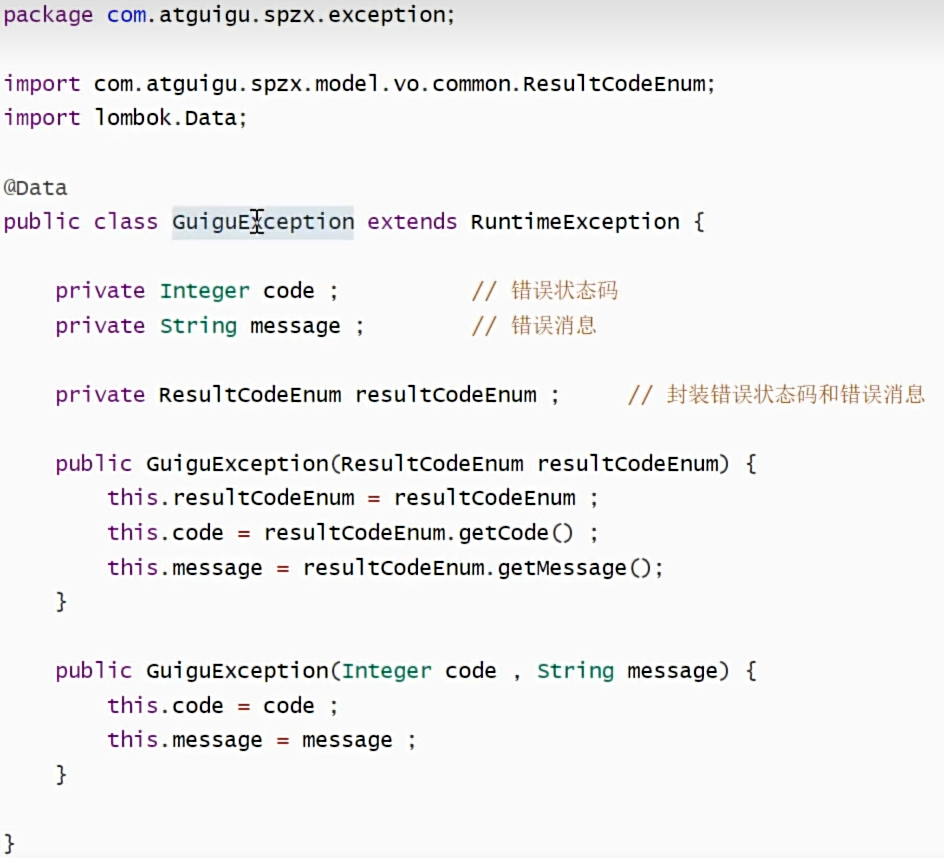
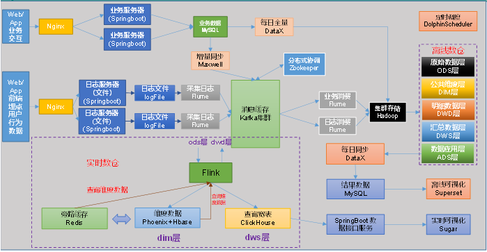
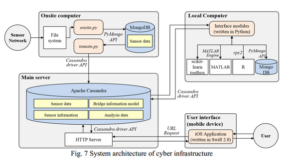

# springboot-hbase-ifc
springboot整合hbase和ifctoolbox

## 1、系统介绍

该系统旨在建立一个桥梁建养一体化健康监测系统，基于国际BIM标准IFC，将桥梁建造和养护阶段之间的数据连接起来。

该系统采用前后端分离的框架，
后端主要使用大数据技术将BIM信息和监测系统数据存储在HBase数据库和Hadoop集群中，采用springboot框架搭建。

前端主要进行模型的展示，监测数据的实时显示，利用IFC.JS库进行相关的功能开发，采用Vue框架搭建。

1.1 文件夹介绍

```
model：定义实体类
	--entity：对应数据库表
	--vo：对应发给前端的数据类
	--dto：对应接收前端的数据类
```


## 2、系统架构


## 3、系统功能
### 3.1 系统基本功能
#### 1 登录功能实现

1、接口和数据格式设计

**统一结果实体类设计**

为了给前端提供API接口以及数据，需要提前定义好提交给前端的数据格式，为了方便前端解析数据，需要统一返回的数据格式，一般选择通过json格式返回。

这里我们创建一个统一结果实体类，前端要求的类型：

```ts
//前端定义接收的数据类型,前端ts类型还需要改
interface dataType {
  token?: string; 
}
// 定义登录接口返回数据的类型
//登陆用户返回数据类型定义
export interface LoginResult {
  code: number;
  message?: string;
  data: dataType;
}
```

我们一般只需定义这样一个格式:{code,data,message}

在后端定义一个Result返回结果实体类，将其放置在model文件夹下的vo文件夹中

```java
// 对应login接口返回给前端的data：token或者null
@Data
@Schema(description = "登录成功返回的响应结果实体类")
public class LoginVo {
    // 返回给前端的数据
    @Schema(description = "token令牌")
    private String token;
}
```

**统一异常处理**

通过两个注解来实现

```java
@ControllerAdvice Controller增强器
@ExceptionHandler 捕获controller异常
```


自定义异常

通过继承RuntimeException来编写自定义异常类，自定义异常需要手动抛出。



**编写接口**

登录接口

获取用户信息接口

退出登录接口

#### 2 用户认证与授权

使用JWT来实现前后端分离认证，流程和很多框架的一样，这里省略。（原先打算使用spring security进行认证授权，发现还是太麻烦了。后面再进行考虑）

主要就是生成token发送给前端，然后使用redis存储用户信息。

用户授权主要需要通过用户表、角色表、菜单表以及关系表来实现用户权限，这需要修改前端代码，后续看需求再进行添加。

#### 3 用户数据库设计

使用mysql来存储用户信息，用户主要有以下表，`用户表、角色表、用户-角色关系表`，如果还要权限的话，就需要`权限表和权限-角色表`。

### 3.2、BIM数据存储

BIM数据主要存储在HBase数据库中，现在已经利用ifcopenshell将ifc文件存储进HBase中，但仍有以下问题：

1、如何从HBase中提取数据？

使用springboot连接hbase

2、从HBase中提取的IFC数据有用吗？

因为我们已经给前端穿了一个IFC文件了，这时再从hbase中查询数据还有用吗？

或者通过查询rowkey来与EBS进行关联。

3、需要搭建实时数仓吗？

搭建实时数仓是比较多余的，只需要加入一个Kafka做为消息中间件就够了。



### 3.3、监测数据存储

监测数据传输主要是根据文献中这一解决方案。现阶段主要是无法进行现场实验，相关接口和传感网络无法搭建。

监测数据也是存储在HBase中，通过kafka作为中间件存入。



### 3.4 


### 3.6、监测预警


## 4、系统部署
### 4.1、环境准备
#### 4.1.1、大数据环境搭建
hadoop集群搭建
zookeeper集群搭建
hbase数据库搭建
karaf集群搭建
flink集群搭建

#### 4.1.2、springboot环境搭建

#### 4.1.3、Vue环境搭建

### 4.2、数据库准备
#### 4.2.1、HBase数据库


#### 4.2.2、MySQL数据库
主要用来存储用户信息

### 4.3、系统部署
#### 4.3.1、后端部署
部署到linux平台
#### 4.3.2、前端部署
部署到linux平台

## 5、系统测试
### 5.1、BIM数据存储测试
### 5.2、监测数据存储测试
### 5.3、现场实验测试

